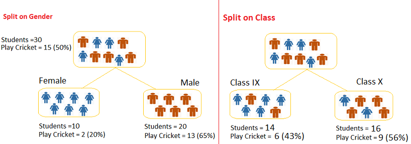

# DECISION TREE

## Introduction
Decision Tree is a supervised learning algorithm that can perform both classification and regression tasks. The goal of using a Decision Tree is to build a training model that can predict the class or value of the target variable based on decision rules inferred from the training data.

              

In a decision tree a node represents an attribute, each branch represents a decision rule and each leaf represents an outcome.

## Steps Involved in Building a Decision Tree

1. Splitting - *Partitioning the dataset based on various factors*.
2. Pruning - *It involves removing the branches that make use of attributes having low importance* .
3. Tree Selection -*Finding the tree that fits the data well based on the cross-validated error* .

 

## Some Algorithm used in Decision Tree

 - Classification and Regression Trees (CART ) which uses  **Gini Index**  as metric.
 - Iterative Dichotomiser 3 (ID3) uses  **Entropy function** and  **Information gain**  as metrics.

## Advantages 

 - Easy Interpretation 
 - No Normalization
 -  Requires little data preprocessing 
 -  Fast for inference
 

## Disadvantages

 - Tends to overfit. 
 - Training is relatively expensive.
 -  A small change in the data can cause instability.

## References

- https://towardsdatascience.com/decision-trees-in-machine-learning-641b9c4e8052
- https://machinelearningmastery.com/implement-decision-tree-algorithm-scratch-python/
- https://www.youtube.com/watch?v=PHxYNGo8NcI&t=546s 
- https://www.youtube.com/watch?v=wr9gUr-eWdA
