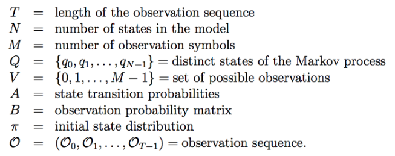
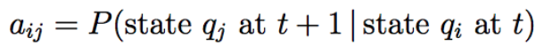
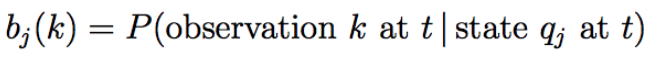
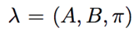
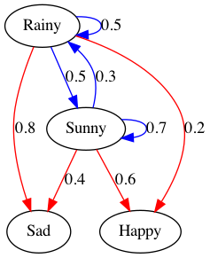

# Hidden Markov Model

## What is a Hidden Markov Model?

A Hidden Markov Model (HMM) is a statistical Markov model in with the system being modeled is assumed to be a Markov process with hidden states.

An HMM allows us to talk about both observed events (like words that we see in the input) and hidden events (like Part-Of-Speech tags).

An HMM is specified by the following components:



**State Transition Probabilities** are the probabilities of moving from state i to state j.
  


**Observation Probability Matrix** also called emission probabilities, express the probability of an observation Ot being generated from a state i.



**Initial State Distribution** $\pi$i is the probability that the Markov chain will start in state i. Some state j with $\pi$j=0 means that they cannot be initial states.

Hence, the entire Hidden Markov Model can be described as,



# Example

For the example in ```main.py``` the Hidden Markov Model is as follows:

