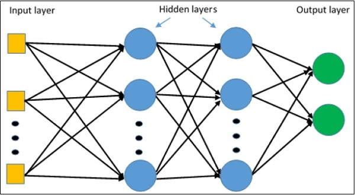
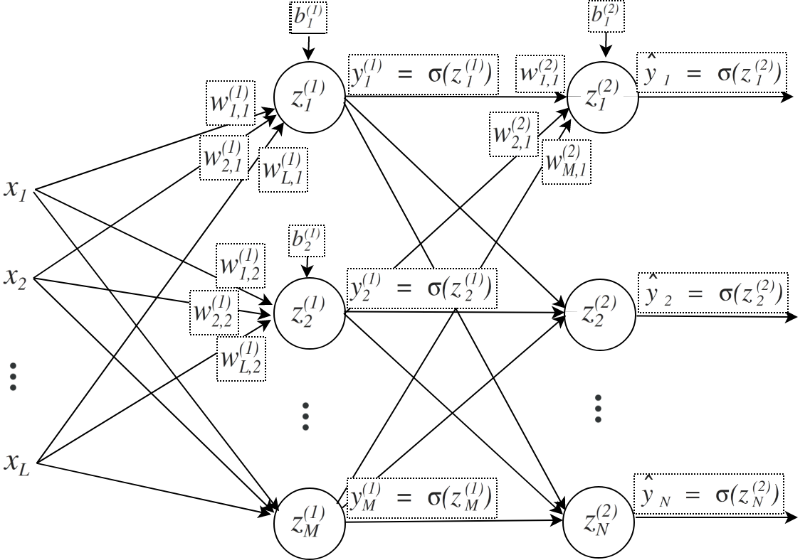

# MULTILAYER PERCEPTRON
## Introduction
- A class of feedforward artificial neural network
- A network consisting of multiple layers of neurons
- major use cases : approximation, pattern classification, prediction, recognition \
\

## Network details
- One input layer where inputs are given
- One or more hidden layers (n)
- Does most of computation
- One output layer where classification or prediction outputs are computed
## Calculations
- Computations take place at every neuron in the hidden or output layers
- Lets assume the previous neuron outputs are vector x, the weights of the edges from previous to current layer neurons are in matrix w, and bias vector is b: thus current layer h=G(wTx+b), where G(x) refers to an activation function, like sigmoid.
- Next step after calculating all values of h till output layer, is to perform backpropogation to learn the learnable factors like weights and biases
- For backpropogation, we find the loss at the ouput layer and backpropogate to find how much the loss changes wrt each previous layer, and change the factors with that amount
\
\

\
\
## References 
### Reading References
- http://ml.informatik.uni-freiburg.de/former/_media/teaching/ss10/05_mlps.printer.pdf
- http://www.sfu.ca/iat813/lectures/lecture8.html
- http://www.cnel.ufl.edu/courses/EEL6814/chapter3.pdf
- https://machinelearningmastery.com/neural-networks-crash-course/
### Video References
- https://www.youtube.com/watch?v=u5GAVdLQyIg&ab_channel=TheCodingTrain
- https://www.youtube.com/watch?v=MxVXIeOj-EY&ab_channel=KindsonTheGenius
- https://www.youtube.com/watch?v=pbQtQ2Bdzf8&ab_channel=PowerH
- https://www.youtube.com/watch?v=xQ0RwgyejVc&ab_channel=GreatLearning
